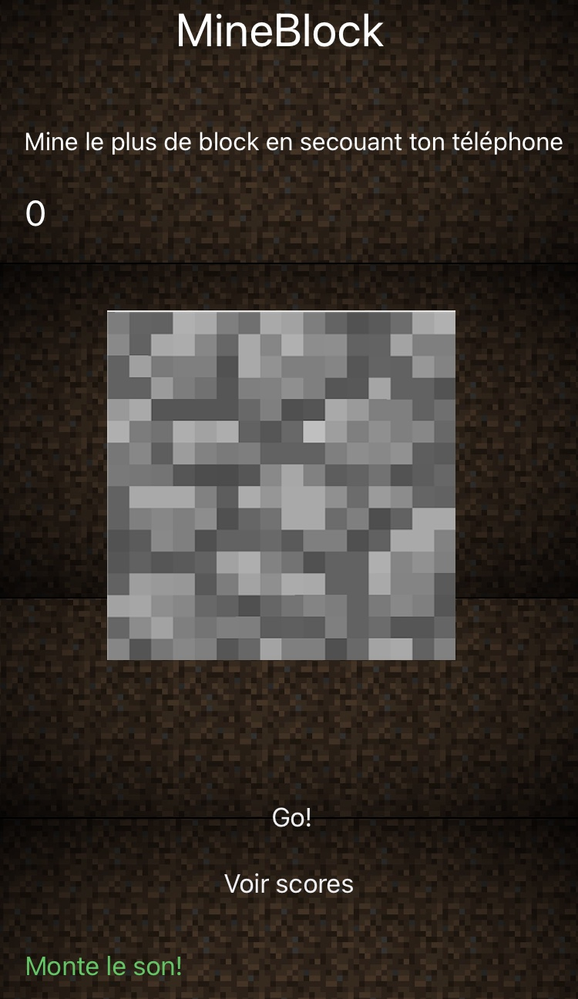
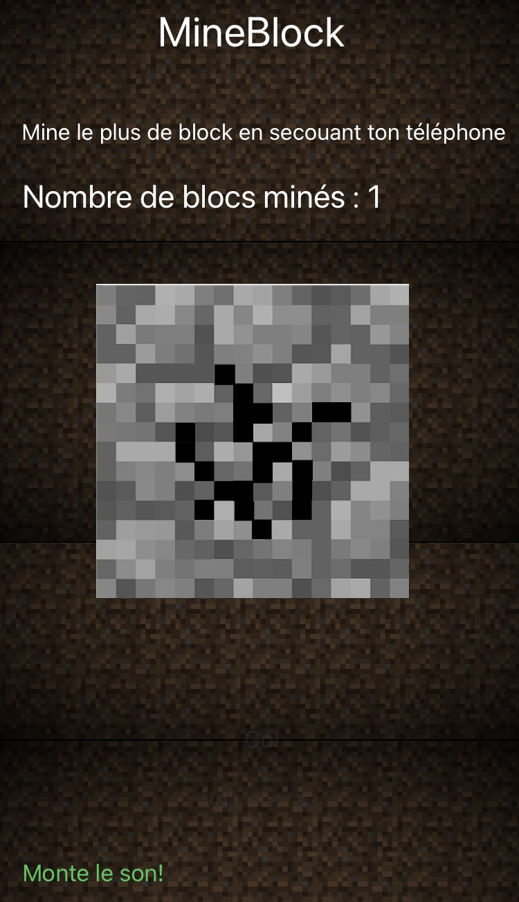

# Hammer

## Project Overview

**Hammer** is a creative game development project built using Xcode, where I received a score of **19/20**. The initial goal of the project was to utilize the iPhone's accelerometer to create a game. However, I decided to expand on this idea and develop a unique mining game inspired by the game Minecraft.

## Game Description

In **Hammer**, players shake their iPhones to mine blocks, making the gameplay engaging and interactive. The primary objectives are:

- **Mining Blocks**: Shake your device to break as many blocks as possible.
- **Scoreboard**: A scoreboard tracks the player's score, adding a competitive element to the game.
- **Dynamic Sounds**: The game features various sound effects based on the player's score, including mining sounds and menu click sounds reminiscent of Minecraft.
- **Visual Feedback**: The game provides a dynamic interface where the block textures update as players shake their phones, visually representing the mining process as blocks become increasingly broken.

## Features

- **Accelerometer Integration**: Utilizes the iPhone's accelerometer for interactive gameplay.
- **Sound Effects**: Includes immersive sound effects to enhance the gaming experience.
- **Scoreboard System**: Keeps track of players' scores and allows them to compete for high scores.
- **Dynamic Visuals**: The game updates block textures in real-time, providing instant feedback to players.

    
    

